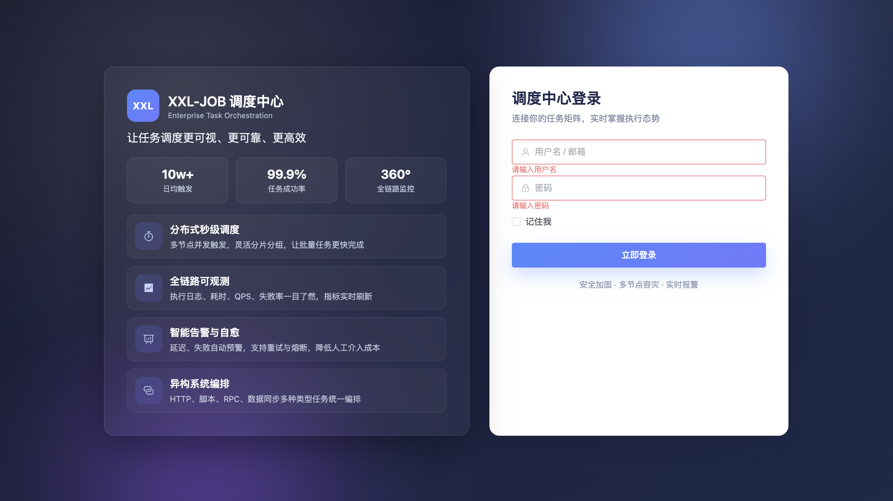
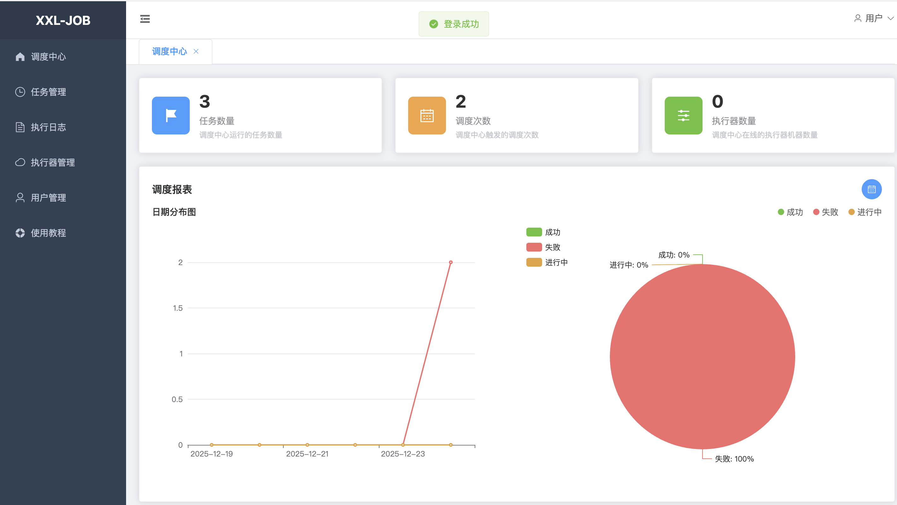
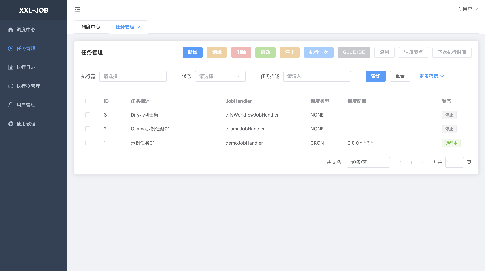
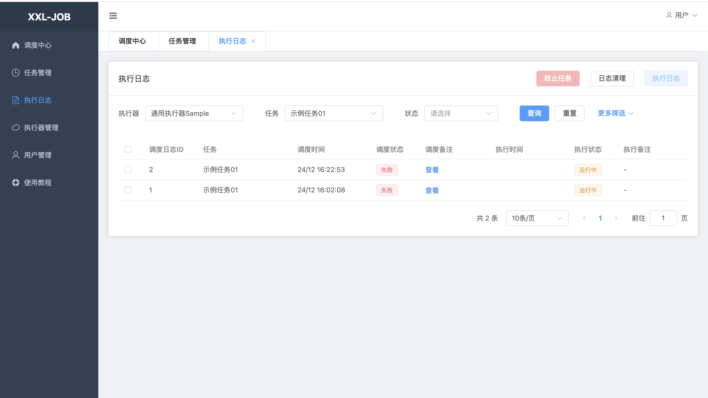

# XXL-JOB Admin UI

基于 Vue 3 + Element Plus 的 XXL-JOB 管理界面前端项目

## 技术栈

- **Vue 3** - 渐进式 JavaScript 框架
- **Element Plus** - Vue 3 组件库
- **Vue Router** - 官方路由管理器
- **Pinia** - Vue 状态管理
- **Axios** - HTTP 客户端
- **ECharts** - 数据可视化
- **Vite** - 下一代前端构建工具
- **Day.js** - 轻量级日期处理库

## 项目结构

```
xxl-job-admin-ui/
├── src/
│   ├── api/              # API接口封装
│   │   ├── auth.js       # 认证相关API
│   │   ├── job.js        # 任务管理API
│   │   ├── joblog.js     # 执行日志API
│   │   ├── jobgroup.js   # 执行器管理API
│   │   ├── user.js       # 用户管理API
│   │   └── dashboard.js  # 仪表盘API
│   ├── assets/           # 静态资源
│   ├── components/       # 公共组件
│   ├── layout/           # 布局组件
│   │   └── index.vue     # 主布局（侧边栏、头部、标签页）
│   ├── router/           # 路由配置
│   │   └── index.js      # 路由定义
│   ├── stores/           # Pinia状态管理
│   │   └── user.js       # 用户状态
│   ├── utils/            # 工具函数
│   │   └── request.js    # Axios封装
│   ├── views/            # 页面组件
│   │   ├── Login.vue     # 登录页
│   │   ├── Dashboard.vue # 仪表盘
│   │   ├── JobInfo.vue   # 任务管理
│   │   ├── JobLog.vue    # 执行日志
│   │   ├── JobGroup.vue  # 执行器管理
│   │   ├── User.vue      # 用户管理
│   │   └── components/   # 页面组件
│   │       └── JobFormDialog.vue  # 任务表单对话框
│   ├── App.vue           # 根组件
│   └── main.js           # 入口文件
├── index.html            # HTML模板
├── vite.config.js        # Vite配置
└── package.json          # 项目配置
```

## 环境要求

- **Node.js**: >= 16.0.0 (推荐使用 18.x 或更高版本)
- **npm**: >= 7.0.0 (或使用 yarn/pnpm)

> ⚠️ 注意：Vite 5.x 需要 Node.js 16+ 版本。如果您的 Node.js 版本较低，请先升级 Node.js。

### 检查 Node.js 版本

```bash
node --version
```

如果版本低于 16，请升级 Node.js：
- 使用 [nvm](https://github.com/nvm-sh/nvm) (推荐): `nvm install 18 && nvm use 18`
- 或从 [Node.js 官网](https://nodejs.org/) 下载安装

## 快速开始

### 1. 安装依赖

```bash
cd xxl-job-admin-ui
npm install
```

### 2. 配置后端API地址

创建 `.env.development` 文件（开发环境）：

```env
VITE_API_BASE_URL=http://localhost:8080/xxl-job-admin
```

创建 `.env.production` 文件（生产环境）：

```env
VITE_API_BASE_URL=/xxl-job-admin
```

### 3. 启动开发服务器

```bash
npm run dev
```

访问 http://localhost:3000

### 4. 构建生产版本

```bash
npm run build
```

构建产物在 `dist` 目录

### 5. 预览生产构建

```bash
npm run preview
```

## 功能特性

### 已实现的功能

1. **用户认证**
   - 登录/登出
   - 修改密码
   - 基于Cookie的会话管理

2. **任务管理**
   - 任务列表查询（支持多条件筛选）
   - 新增/编辑任务
   - 删除任务
   - 启动/停止任务
   - 手动执行任务
   - 支持多种调度类型（CRON、FIX_RATE等）
   - 支持多种运行模式（BEAN、GLUE等）

3. **执行日志**
   - 日志列表查询
   - 日志详情查看
   - 终止运行中的任务
   - 支持时间范围筛选

4. **执行器管理**
   - 执行器列表管理
   - 新增/编辑执行器
   - 删除执行器
   - 支持自动注册和手动录入

5. **用户管理**
   - 用户列表查询
   - 新增/编辑用户
   - 删除用户
   - 角色管理（普通用户/管理员）

6. **仪表盘**
   - 任务统计（总数、成功、失败、运行中）
   - 执行趋势图表（ECharts）
   - 支持日期范围筛选

7. **UI特性**
   - 响应式布局
   - 侧边栏菜单（可折叠）
   - 多标签页管理
   - 现代化UI设计

## 界面截图
- 登录页  
  
- 仪表盘  
  
- 任务列表  
  
- 执行日志  
  

## API接口说明

所有API接口都通过 `src/utils/request.js` 统一封装，支持：

- 自动携带Cookie（withCredentials: true）
- 统一错误处理
- 请求/响应拦截
- 自动跳转登录页（401错误）

### API基础路径

- 开发环境：`http://localhost:8080/xxl-job-admin`
- 生产环境：`/xxl-job-admin`

### 主要API端点

- `/auth/doLogin` - 登录
- `/auth/logout` - 登出
- `/auth/updatePwd` - 修改密码
- `/jobinfo/pageList` - 任务列表
- `/jobinfo/insert` - 新增任务
- `/jobinfo/update` - 更新任务
- `/jobinfo/delete` - 删除任务
- `/jobinfo/start` - 启动任务
- `/jobinfo/stop` - 停止任务
- `/jobinfo/trigger` - 执行任务
- `/joblog/pageList` - 日志列表
- `/joblog/logDetailCat` - 日志详情
- `/joblog/logKill` - 终止任务
- `/jobgroup/pageList` - 执行器列表
- `/user/pageList` - 用户列表
- `/chartInfo` - 图表数据

## 部署说明

### 方式一：独立部署

1. 构建前端项目：
   ```bash
   npm run build
   ```

2. 将 `dist` 目录部署到 Nginx 或其他静态服务器

3. 配置 Nginx 代理后端API：
   ```nginx
   server {
       listen 80;
       server_name your-domain.com;
       
       # 前端静态文件
       location / {
           root /path/to/dist;
           try_files $uri $uri/ /index.html;
       }
       
       # 后端API代理
       location /xxl-job-admin {
           proxy_pass http://localhost:8080;
           proxy_set_header Host $host;
           proxy_set_header X-Real-IP $remote_addr;
       }
   }
   ```

### 方式二：集成到后端项目

1. 构建前端项目：
   ```bash
   npm run build
   ```

2. 将 `dist` 目录内容复制到后端项目的 `src/main/resources/static/` 目录

3. 配置后端支持SPA路由（Spring Boot配置）：
   ```java
   @Configuration
   public class WebConfig implements WebMvcConfigurer {
       @Override
       public void addResourceHandlers(ResourceHandlerRegistry registry) {
           registry.addResourceHandler("/**")
                   .addResourceLocations("classpath:/static/");
       }
   }
   ```

## 开发说明

### 添加新页面

1. 在 `src/views/` 创建页面组件
2. 在 `src/router/index.js` 添加路由配置
3. 在 `src/api/` 创建对应的API文件

### 添加新API

1. 在对应的 `src/api/*.js` 文件中添加API函数
2. 在页面组件中导入并使用

### 自定义主题

Element Plus 支持主题定制，可以通过修改 `src/main.js` 中的配置来自定义主题色。

## 注意事项

1. **Cookie认证**：项目使用Cookie进行身份认证，确保后端支持CORS和Cookie传递
2. **API响应格式**：后端API需要返回统一格式：
   ```json
   {
     "code": 200,
     "msg": "success",
     "content": {}
   }
   ```
3. **路由守卫**：已实现路由守卫，未登录用户会自动跳转到登录页
4. **权限控制**：管理员功能（执行器管理、用户管理）需要后端返回用户角色信息

## 浏览器支持

- Chrome（推荐）
- Firefox
- Safari
- Edge

## 许可证

与 XXL-JOB 主项目保持一致

## 联系方式

如有问题，请提交 Issue 或联系项目维护者
